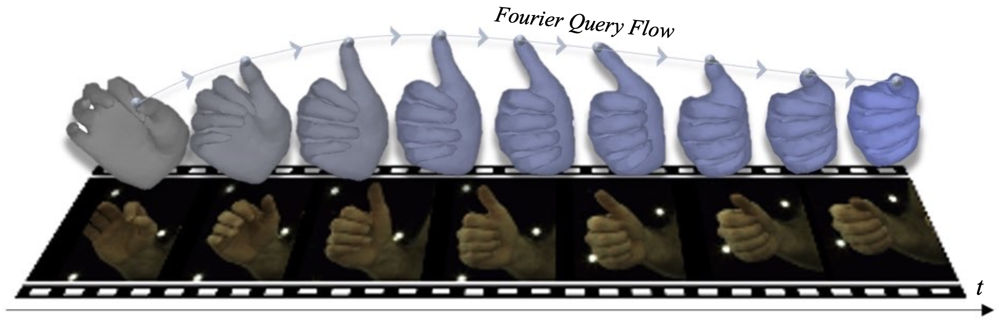

# FourierHandFlow

## FourierHandFlow: Neural 4D Hand Representation Using Fourier Query Flow (NeurIPS 2023) ##

[Jihyun Lee](https://jyunlee.github.io/), [Junbong Jang](https://junbongjang.github.io/), [Donghwan Kim](https://donghwankim0101.github.io/), [Minhyuk Sung](https://mhsung.github.io/), [Tae-Kyun (T-K) Kim](https://sites.google.com/view/tkkim/home)

**\[[Project Page](https://jyunlee.github.io/projects/fourier-hand-flow/)\] \[[Paper](https://arxiv.org/pdf/2307.08100.pdf)\] \[[Supplementary Video](https://youtu.be/gDnYcQni_Gk)\]**

---

<p align="center">
  
</p>


> We present FourierHandFlow, which is a spatio-temporally continuous representation for human hands that combines a 3D occupancy field with articulation-aware query flows represented as Fourier series. Given an input RGB sequence, we aim to learn a fixed number of Fourier coefficients for each query flow to guarantee smooth and continuous temporal shape dynamics. To effectively model spatio-temporal deformations of articulated hands, we compose our 4D representation based on two types of Fourier query flow: (1) pose flow that models query dynamics influenced by hand articulation changes via implicit linear blend skinning and (2) shape flow that models query-wise displacement flow.

&nbsp;

📌 _The code instructions will be updated shortly!_

&nbsp;

## Citation

If you find this work useful, please consider citing our paper.

```
@InProceedings{lee2023fourierhandflow,
    author = {Lee, Jihyun and Jang, Junbong and Kim, Donghwan and Sung, Minhyuk and Kim, Tae-Kyun},
    title = {FourierHandFlow: Neural 4D Hand Representation Using Fourier Query Flows},
    booktitle = {NeurIPS},
    year = {2023}
}
```

